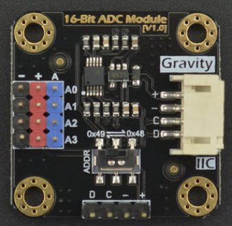

# DFRobot_ADS1115

* [中文版](./README_CN.md)

The ADS1115 is a high precision analog-to-digital converter (ADC) with 16-bit resolution. And with A0-A3, 4 ADC ports

 

## Product Link（[https://www.dfrobot.com/product-1730.html](https://www.dfrobot.com/product-1730.html)）
    SKU: DFR0553

## Table of Contents
* [Summary](#summary)
* [Installation](#installation)
* [Methods](#methods)
* [Compatibility](#compatibility)
* [History](#history)
* [Credits](#credits)

## Summary

Provides an Arduino library to read ADS1115 data over I2C. Use this library to read analog voltage values.

## Installation

To use this library download the zip file, uncompress it to a folder named DFRobot_ADS1115. 
Download the zip file first to use this library and uncompress it to a folder named DFRobot_ADS1115. 

## Methods

```C++
 /**
  * @fn DFRobot_ADS1115
  * @brief Sets the IIC address
  * @param pWire The pointer of TwoWire class object.
  */
  DFRobot_ADS1115(TwoWire *pWire);

  /**
   * @fn setAddr_ADS1115
   * @brief Sets the IIC address
   * @param i2cAddress: 7 bits I2C address, the range is 1~127.
   */
  void setAddr_ADS1115(uint8_t i2cAddress);

  /**
   * @fn init
   * @brief init ADS1115 device
   */
  void init(void);

  /**
   * @fn checkADS1115
   * @brief Checks the connection status of ads1115
   * @return result:
   * @retval true or false
   */
  bool checkADS1115();

  /**
   * @fn setCompQue
   * @brief  Sets the Comparator queue and disable .
   * @n This perform two functions. 
   * @n It can disable the comparator function and put the ALERT/RDY pin into a high state. 
   * @n It also can control the number of successive conversions exceeding the upper
   * @n or lower thresholds required before asserting the ALERT/RDY pin.
   * @param value  The enum variable struct of  eADSCompLat_t
   * @n eCOMPQUE_ONE
   * @n eCOMPQUE_TWO
   * @n eCOMPQUE_FOUR
   * @n eCOMPQUE_NONE
   */
  void setCompQue(eADSCompQue_t value);

  /**
   * @fn setCompLat
   * @brief  Sets the Latching comparator .
   * @n This controls whether the ALERT/RDY pin latches once asserted 
   * @n or clears when conversions are within the margin of the upper 
   * @n and lower threshold values.
   * @param value  The enum variable struct of  eADSCompLat_t
   * @n eCOMPLAT_NONLAT
   * @n eCOMPLAT_LATCH  
   */
  void setCompLat(eADSCompLat_t value);

  /**
   * @fn setCompMode
   * @brief  Sets the Comparator polarity. This controls the polarity of the ALERT/RDY pin
   * @param value  The enum variable struct of  eADSCompPol_t
   * @n eCOMPPOL_LOW
   * @n eCOMPPOL_HIGH  
   */
  void setCompPol(eADSCompPol_t value);

  /**
   * @fn setCompMode
   * @brief Sets the Comparator mode.This controls the comparator mode of operation.
   * @param value  The enum variable struct of  eADSCompMode_t
   * @n eCOMPMODE_TRAD
   * @n eCOMPMODE_WINDOW  
   */
  void setCompMode(eADSCompMode_t value);

  /**
   * @fn setRate
   * @brief Sets the Date Rate. This controls the data rate setting.
   * @param value The enum variable struct of  eADSRate_t
   * @n eRATE_8     8 SPS
   * @n eRATE_16    16 SPS
   * @n eRATE_32    32 SPS
   * @n eRATE_64    64 SPS
   * @n eRATE_128   128 SPS (default) 
   * @n eRATE_250   250 SPS
   * @n eRATE_475   475 SPS
   * @n eRATE_860   860 SPS
   */
  void setRate(eADSRate_t value);

  /**
   * @fn setMode
   * @brief Sets the Device operating mode. This controls the current operational mode of the ADS1115
   * @param value  The enum variable struct of  eADSMode_t 
   * @n eMODE_CONTIN
   * @n eMODE_SINGLE  
   */
  void setMode(eADSMode_t value);

  /**
   * @fn setGain
   * @brief Sets the gain and input voltage range.This configures the programmable gain amplifier
   * @param value  The enum variable struct of  eADSGain_t
   * @n eGAIN_TWOTHIRDS      ADC Range: 0~6.144V (1 bit = 0.1875mV)
   * @n eGAIN_ONE            ADC Range: 0~4.096V (1 bit = 0.125mV)
   * @n eGAIN_TWO            ADC Range: 0~2.048V (1 bit = 0.0625mV)
   * @n eGAIN_FOUR           ADC Range: 0~1.024V (1 bit = 0.03125mV)
   * @n eGAIN_EIGHT          ADC Range: 0~0.512V (1 bit = 0.015625mV)
   * @n eGAIN_SIXTEEN        ADC Range: 0~0.256V (1 bit = 0.0078125mV)
   */
  void setGain(eADSGain_t value);

  /**
   * @fn setMux
   * @brief Sets multiplexer
   * @param value  The enum variable struct of  eADSMux_t
   * @n eADSMUX_1      multiplexer 1
   * @n eADSMUX_2      multiplexer 2
   * @n eADSMUX_3      multiplexer 3
   * @n eADSMUX_4      multiplexer 4
   * @n eADSMUX_5      multiplexer 5
   * @n eADSMUX_6      multiplexer 6
   * @n eADSMUX_7      multiplexer 7
   * @n eADSMUX_8      multiplexer 8
   */
  void setMux(eADSMux_t value);

  /**
   * @fn setOSMode
   * @brief Sets the Operational status/single-shot conversion to start.
   * @n This determines the operational status of the device.
   * @param value  The enum variable struct of  eADSOSMode_t   
   * @n eOSMODE_SINGLE
   * @n eOSMODE_BUSY
   * @n eOSMODE_NOTBUSY
   */
  void setOSMode(eADSOSMode_t value);

  /**
   * @fn readVoltage
   * @brief Reads the voltage of the specified channel
   * @param  channel   The analog channnel of MCU
   * @return Voltage
   */
  uint16_t readVoltage(uint8_t channel);

  /**
   * @fn comparatorVoltage
   * @brief Sets up the comparator causing the ALERT/RDY pin to assert 
   * @n   (go from high to low) when the ADC value exceeds the specified upper or lower threshold
   * @n   ADC is Differential input channel
   * @param channel  The analog channnel of MCU
   * @return Voltage 
   */
  int16_t comparatorVoltage(uint8_t channel);

  /**
   * @fn setLowThreshold
   * @brief Sets the low threshold value
   * @param threshold   The low threshold value
   */
  void setLowThreshold(int16_t threshold);

  /**
   * @fn getLowThreshold
   * @brief Get the low threshold value
   * @return  The low threshold value
   */
  int16_t   getLowThreshold();

  /**
   * @fn setHighThreshold
   * @brief Sets the high threshold value
   * @param threshold   The high threshold value
   */
  void setHighThreshold(int16_t threshold);
  
  /**
   * @fn getHighThreshold
   * @brief Get the high threshold value
   * @return  The high threshold value
   */
  int16_t   getHighThreshold();
```

## Compatibility

MCU                | Work Well | Work Wrong | Untested  | Remarks
------------------ | :----------: | :----------: | :---------: | -----
FireBeetle-ESP32  |      √       |             |            | 
FireBeetle-ESP8266  |      √       |             |            | 
Arduino uno |       √      |             |            | 

## History

- 2019/06/19 - Version 0.1 released.

## Credits

Written by luoyufeng(yufeng.luo@dfrobot.com), 2018. (Welcome to our [website](https://www.dfrobot.com/))
