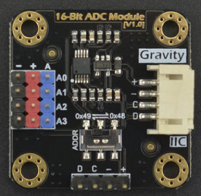

# DFRobot_ADS1115

- [English Version](./README.md)

ADS1115 16位AD转换模块可对模拟量信号进行精确的采集与转换，通过这款AD模块，树莓派主控板就能非常方便的使用种类丰富的Gravity系列模拟量传感器，测量各类信号，感知这个世界。

 


## 产品链接（[https://www.dfrobot.com.cn/goods-1734.html](https://www.dfrobot.com.cn/goods-1734.html)）
    SKU: DFR0553

## 目录

  * [概述](#概述)
  * [库安装](#库安装)
  * [方法](#方法)
  * [兼容性](#兼容性)
  * [历史](#历史)
  * [创作者](#创作者)

## 概述

提供一个python库给ADS1115传感器，以通过I2C接口读取模拟电压值。

## 库安装
1. 下载库至树莓派，要使用这个库，首先要将库下载到Raspberry Pi，命令下载方法如下:<br>
```python
sudo git clone https://github.com/DFRobot/DFRobot_ADS1115
```
2. 打开并运行例程，要执行一个例程demo_x.py，请在命令行中输入python demo_x.py。例如，要执行 demo_read_voltage.py例程，你需要输入:<br>

```python
python demo_read_voltage.py 
或 
python2 demo_read_voltage.py 
```

## 方法

```python
  '''!
    @brief 设置增益和输入电压范围。
    @param gain  This configures the programmable gain amplifier
    @n ADS1115_REG_CONFIG_PGA_6_144V     = 0x00 # 6.144V range = Gain 2/3
    @n ADS1115_REG_CONFIG_PGA_4_096V     = 0x02 # 4.096V range = Gain 1
    @n ADS1115_REG_CONFIG_PGA_2_048V     = 0x04 # 2.048V range = Gain 2
    @n 默认:
    @n ADS1115_REG_CONFIG_PGA_1_024V     = 0x06 # 1.024V range = Gain 4
    @n ADS1115_REG_CONFIG_PGA_0_512V     = 0x08 # 0.512V range = Gain 8
    @n ADS1115_REG_CONFIG_PGA_0_256V     = 0x0A # 0.256V range = Gain 16
  '''
  def set_gain(self,gain):
		
  '''!
    @brief 设置I2C地址
    @param addr  7位I2C地址，范围 1~127.
  '''	
  def set_addr_ADS1115(self,addr):
		
  '''!
    @brief 从 0-3 中选择要使用的频道用户。
    @param channel  通道: 0-3
    @n 对于单端输出：
    @n    0 : AINP = AIN0 and AINN = GND
    @n    1 : AINP = AIN1 and AINN = GND
    @n    2 : AINP = AIN2 and AINN = GND
    @n    3 : AINP = AIN3 and AINN = GND
    @n 对于差分输出：
    @n    0 : AINP = AIN0 and AINN = AIN1
    @n    1 : AINP = AIN0 and AINN = AIN3
    @n    2 : AINP = AIN1 and AINN = AIN3
    @n    3 : AINP = AIN2 and AINN = AIN3
    @return channel
  '''
  def set_channel(self,channel):
	
  '''!
    @brief 使用单次读取的配置。
  '''
  def set_single(self):
	
  '''!
    @brief 配置为比较器输出。
  '''
  def set_differential(self):

  '''!
    @brief  读取ADC值
    @return 原始ADC
  '''	
  def read_value(self):

  '''!
    @brief 读取指定通道的电压。
    @param channel  通道: 0-3
    @n 对于单端输出：
    @n    0 : AINP = AIN0 and AINN = GND
    @n    1 : AINP = AIN1 and AINN = GND
    @n    2 : AINP = AIN2 and AINN = GND
    @n    3 : AINP = AIN3 and AINN = GND
    @n 对于差分输出：
    @n    0 : AINP = AIN0 and AINN = AIN1
    @n    1 : AINP = AIN0 and AINN = AIN3
    @n    2 : AINP = AIN1 and AINN = AIN3
    @n    3 : AINP = AIN2 and AINN = AIN3
    @return 电压值
  '''
  def read_voltage(self,channel):
		
  '''!
    @brief 设置比较器，使 ALERT/RDY 引脚置位。
    @param channel  通道: 0-3
    @n 对于单端输出：
    @n    0 : AINP = AIN0 and AINN = GND
    @n    1 : AINP = AIN1 and AINN = GND
    @n    2 : AINP = AIN2 and AINN = GND
    @n    3 : AINP = AIN3 and AINN = GND
    @n 对于差分输出：
    @n    0 : AINP = AIN0 and AINN = AIN1
    @n    1 : AINP = AIN0 and AINN = AIN3
    @n    2 : AINP = AIN1 and AINN = AIN3
    @n    3 : AINP = AIN2 and AINN = AIN3
    @return 电压值
  '''
  def comparator_voltage(self,channel):
```

## 兼容性

| 主板         | 通过 | 未通过 | 未测试 | 备注 |
| ------------ | :--: | :----: | :----: | :--: |
| RaspberryPi2 |      |        |   √    |      |
| RaspberryPi3 |      |        |   √    |      |
| RaspberryPi4 |  √   |        |        |      |

* Python 版本

| Python  | 通过 | 未通过 | 未测试 | 备注 |
| ------- | :--: | :----: | :----: | ---- |
| Python2 |  √   |        |        |      |
| Python3 |     |        |    √   |      |

## 历史

- 2019/06/19 - 1.0.0 版本

## 创作者

Written by luoyufeng(yufeng.luo@dfrobot.com), 2018. (Welcome to our [website](https://www.dfrobot.com/))


